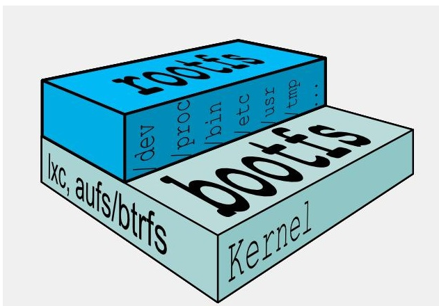
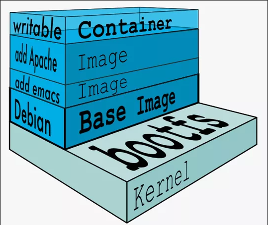

# Docker 镜像

## 是什么

### 是什么

镜像是一种轻量级、可执行的独立软件包，它包含运行某个软件所需的所有内容，我们把应用程序和配置依赖打包好形成一个可交付的运行环境（包括代码、运行时需要的库、环境变量和配置文件等），这个打包好的运行环境就是 image 镜像文件。只有通过这个镜像文件才能生成 Docker 容器实例（类似 Java 中 new 出来一个对象）。

### 分层的镜像

以我们的 pull 为例，在下载的过程中我们可以看到 Docker 的镜像好像是在一层一层的下载。

### UnionFS（联合文件系统）

UnionFS（联合文件系统）：Union 文件系统（UnionFS）是一种分层、轻量级并且高性能的文件系统，它支持对文件系统的修改作为一次提交来一层层的叠加，同时可以将不同目录挂载到同一个虚拟文件系统下（unite several directories into a single virtual filesystem）。Union 文件系统是 Docker 镜像的基础。镜像可以通过分层来进行继承，基于基础镜像（没有父镜像），可以制作各种具体的应用镜像。

特性：一次同时加载多个文件系统，但从外面看起来，只能看到一个文件系统，联合加载会把各层文件系统叠加起来，这样最终的文件系统包含所有底层的文件和目录。

### Docker 镜像加载原理

Docker 的镜像实际上由一层一层的文件系统组成，这种层级的文件系统 UnionFS。

BootFS（Boot File System）主要包含 BootLoader 和 Kernel，BootLoader 主要是引导加载 Kernel，Linux 刚启动时会加载 BootFS 文件系统，在 Docker 镜像的最底层是引导文件系统 BootFS。这一层与我们典型的 Linux/Unix 系统是一样的，包含 Boot 加载器和内核。当 Boot 加载完成之后整个内核就都在内存中了，此时内存的使用权已由 BootFS 转交给内核，此时系统也会卸载 BootFS。

RootFS（Root File System），在 BootFS 之上。包含的就是典型的 Linux 系统中的 /dev、/proc、/bin、/etc 等标准目录和文件。RootFS 就是各种不同的操作系统发行版，比如 Ubuntu，CentOS 等等。

> 平时我们安装进虚拟机的 CentOS 都是好几个 G，为什么 Docker 这里才 200M？
>
> 答：对于一个精简的 OS，RootFS 可以很小，只需要包括最基本的命令、工具和程序库就可以了，因为底层直接用 Host 的 Kernel，自己只需要提供 RootFS 就行了。由此可见对于不同的 Linux 发行版，BootFS 基本是一致的，RootFS 会有差别，因此不同的发行版可以公用 BootFS。

### 为什么 Docker 镜像要采用这种分层结构呢？

镜像分层最大的一个好处就是共享资源，方便复制迁移，就是为了复用。

比如说有多个镜像都是从相同的 base 镜像构建而来，那么 Docker Host 只需在磁盘上保存一份 base 镜像；同时内存中也只需加载一份 base 镜像，就可以为所有容器服务了，而且镜像的每一层都可以被共享。

## 重点理解

Docker 镜像层都是只读的，容器层是可写的。当容器启动时，一个新的可写层被加载到镜像的顶部。这一层通常被称作"容器层"，"容器层"之下的都叫"镜像层"。

所有对容器的改动，无论添加、删除、还是修改文件都只会发生在容器层中，只有容器层是可写的，容器层下面的所有镜像层都是只读的。

## Docker 镜像 commit 操作案例

docker commit：提交容器副本使之成为一个新的镜像。

docker commit -m="提交的信息" -a="作者" 容器 ID 要创建的目标镜像名：[标签名]

### 案例演示 Ubuntu 安装 vim

1. 从 Hub 上下载 Ubuntu 镜像到本地并成功运行
2. 原始的默认 Ubuntu 镜像是不带着 vim 命令的

   
3. 外网连通的情况下，安装 vim
4. 安装完成后，commit 我们自己的新镜像
5. 启动我们的新镜像并和原来的对比

### 总结

Docker 中的镜像分层，支持通过扩展现有镜像，创建新的镜像。类似 Java 继承于一个 base 基础类，自己再按需扩展。

新镜像是从 base 镜像一层一层叠加生成的。没安装一个软件，就在现有镜像的基础上增加一层。

